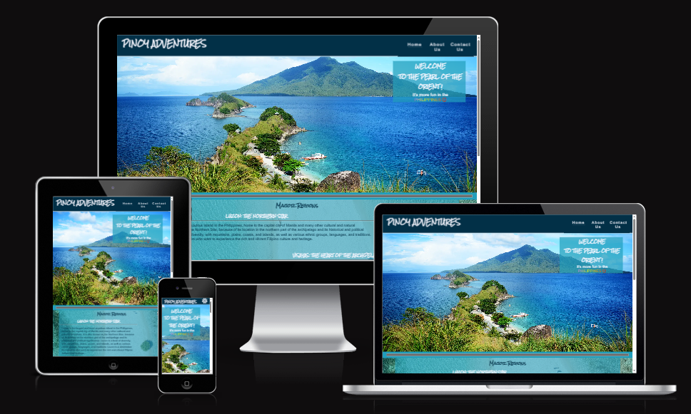
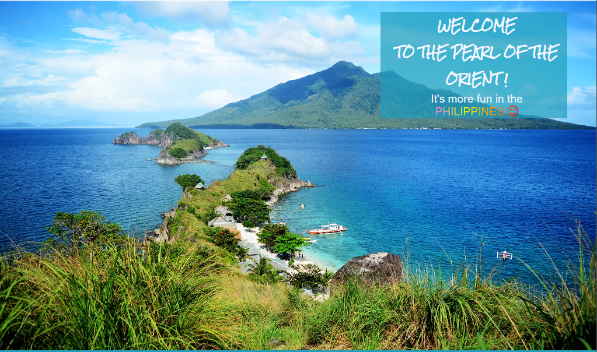
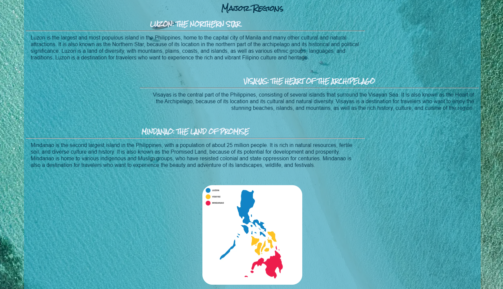
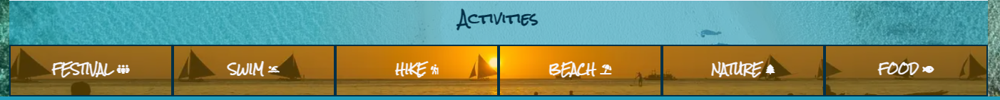
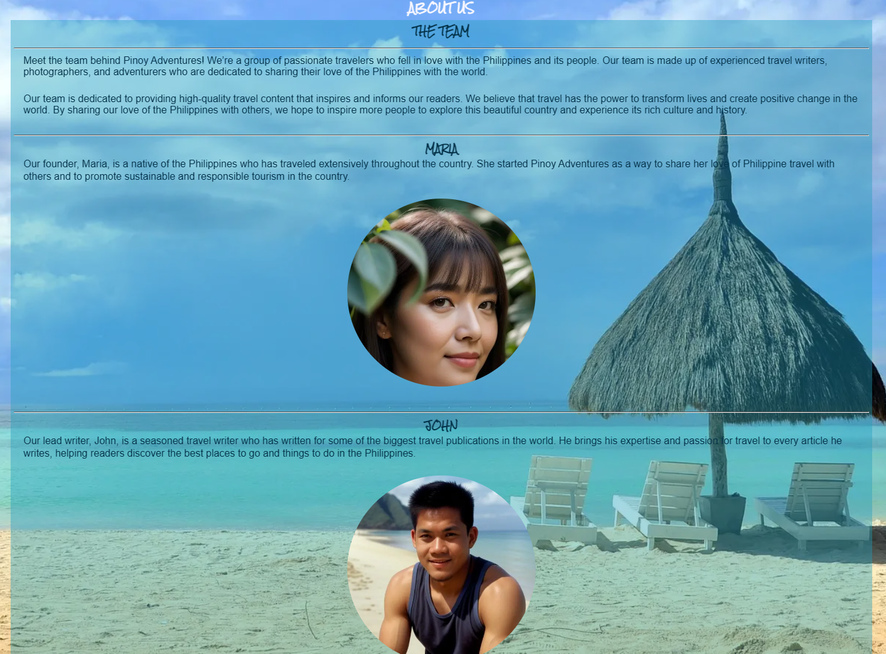
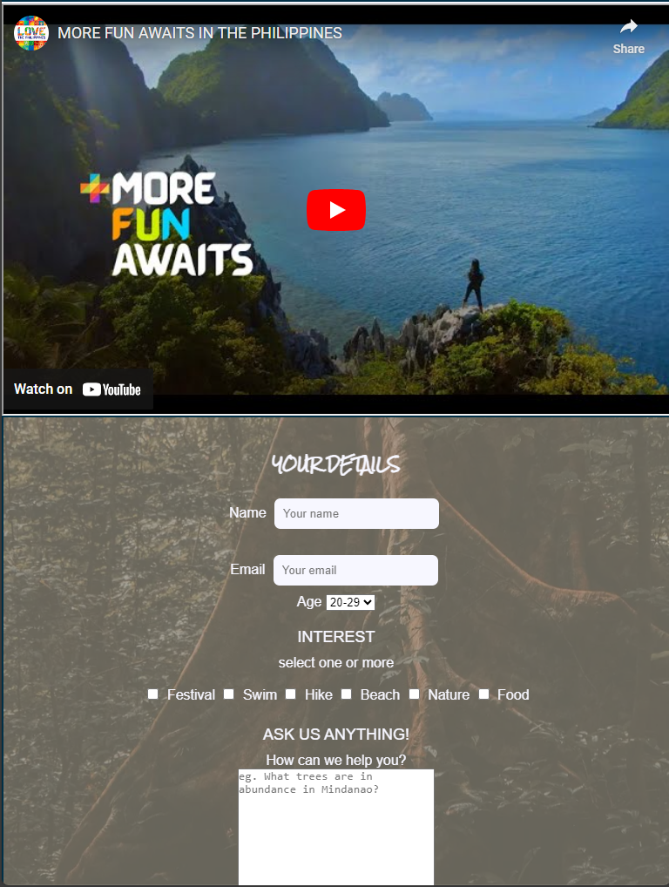

# Pinoy Adventures

## Introduction

**What is Pinoy?**
Derived from the term "Filipino," "Pinoy" is a colloquial term used to refer to people of Filipino descent, as well as the Philippine culture and way of life. In essence, "Pinoy" encapsulates the spirit of the Philippines, representing its warmth, hospitality, and resilience.

**Website Overview**

Welcome to Pinoy Adventures, your gateway to the enchanting landscapes and vibrant culture of the Philippines. Designed to inspire and inform travelers, Pinoy Adventures offers a curated selection of experiences, from idyllic beach retreats to exhilarating mountain hikes, ensuring an unforgettable journey through the archipelago.

## Key Features

- __Navigation Bar__

    - The full responsive navigation bar, which is identical on all three pages, features links to the Home, About Us, Contact Us page, making it easy to navigate between pages

- __Welcome page Section__
    
    - the page has a floating message welcoming the users with the famous phrase "It's more fun in the Philippines"

- __Major Regions Section__

    - The Regions section will give the users some information about the Philippines' three Major regions.
	
	- The text under each region will give the user some idea as to what to expect from the area.

- __Activities__

	- This section will show users some of the activities they're able to do

	- This section will remind users of available activities 

- __Footer__

	- The footer contains the links to social media sites connected to Pinoy Adventures.  Each link will open a new tab when clicked.

	- The footer also contains a back-to-top button for users visiting the site with a small screen real state.

- __About Us Page__

	- This page will introduce the "team".

- __Contact Us Page__

	- This page has a small form for users to send some of their info and also a question to ask the Website owner.

	- This page also has a video for users to watch while filling in the form.

### Future Implementation

- **Interactive Map Integration**: interactive maps highlighting must-visit destinations and local hotspots.

- **User-Generated Content**: Share travel stories and recommendations with the Pinoy Adventures community, creating a dynamic platform for exchanging insights and inspiration.

- **Expand Activities Secion**: Expand the user experience in this section. Add photos of said activity

## Testing

- __Validator__
	- HTML
		- HTML code was meticulously validated via direct input using the W3C validator, ensuring compliance with web standards.
	- CSS
		- CSS stylesheet underwent thorough validation with the Jigsaw validator, guaranteeing consistency and reliability in style rendering.

**Known Issues**

While no major bugs were encountered during testing, minor adjustments was required to optimise performance on bigger devices or browsers.  

**Some issues were:**
- Straggling "\" was flagged by the validator. They were located mainly on the top part of the HTML.  Found out they were created during creating my Boilerplate HTML with the help of Emmet.

- My own issue with coding where I would loose track of ideas and get distracted with another section of the project and continue coding there.  I will need a better planning and take time in creating my next project a section at a time.

## Deployment

- Pinoy Adventures is hosted on GitHub Pages, offering users easy access to the platform.
	-	Steps : In GitHub Repo, go to Settings 
		- select Pages
		- Change Source from Branch to Main
		- Folder set to /root
		- hit Save

Live link - https://jaybielao.github.io/pinoy-adventures/

## Credits

 - __Content__
	- The CSS code for the dropdown menu was taken from the project Love Running. The layout was also influenced by the project

	- Information from the Home page was taken from Wikipedia

		- Luzon https://en.wikipedia.org/wiki/Luzon
		- Visayas https://en.wikipedia.org/wiki/Visayas
		- Mindanao https://en.wikipedia.org/wiki/Mindanao

	- Icons from Font Awesome https://fontawesome.com/

- __Media__

	- Photos used in everypage were free images taken from Pixabay https://pixabay.com/images/search/philippines/

	- Map of the Major Island Group was taken from https://www.discoverthephilippines.com/map-of-philippine-island-groups/

   	- Photos of the Team were AI generated with the use of Bing chat
